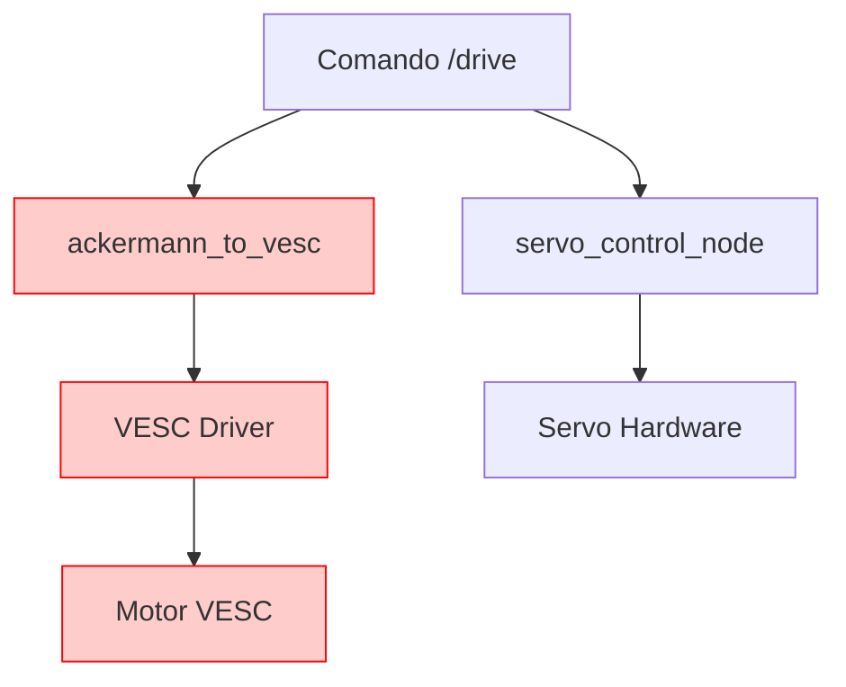

# 🔧 DIAGNÓSTICO COMPLETO - PROBLEMAS MOTOR VESC E SERVO F1TENTH

**Status**: Problemas ativos identificados  
**Data**: 2025-06-20  
**Foco**: Sistema completo motor + servo não respondendo corretamente

---

## 🚨 **PROBLEMAS RELATADOS PELO USUÁRIO**

### ❌ **Servo Motor**
- **Sintoma**: Servo se moveu apenas uma vez, depois parou de responder
- **Observação**: Resposta inicial confirma que hardware e código básico funcionam

### ❌ **Motor VESC** 
- **Sintoma**: Motor não se moveu em nenhum momento
- **Observação**: Sem movimento mesmo com comandos Ackermann válidos

---

## 🔍 **ANÁLISE TÉCNICA DOS COMPONENTES**

### 📋 **Status Atual do Sistema** (Baseado nos Logs)

```bash
# ✅ FUNCIONANDO:
[servo_control_node-1] Servo inicializado no pino GPIO 18 com calibração: centro=1175µs
[servo_control_node-1] Subscrevendo a odometria VESC em: /odom  
[servo_control_node-1] Nó de controle inicializado. Publicando odometria em: /ego_racecar/odom

# ❓ COMANDO TESTADO:
ros2 topic pub /drive ackermann_msgs/msg/AckermannDriveStamped "
  drive:
    steering_angle: 0.3
    speed: 0.5
" --once
```

### 🔧 **Componentes em Execução** (f1tenth_control.launch.py)
1. **servo_control_node** ✅ Inicializado
2. **static_transform_publisher** ✅ Ativo  
3. **Ausentes**: driver VESC, ackermann_to_vesc, vesc_to_odom

---

## 🎯 **DIAGNÓSTICO ESTRUTURAL**

### ⚠️ **PROBLEMA PRINCIPAL IDENTIFICADO**
**O sistema atual está incompleto** - apenas o servo está rodando, mas:

1. **Driver VESC não está executando** 
   - Necessário para comunicação com hardware VESC
   - Sem ele, comandos de velocidade são ignorados

2. **Nó ackermann_to_vesc ausente**
   - Responsável por converter comandos `/drive` para VESC
   - Sem ele, velocidade nunca chega ao motor

3. **Servo perde estado após primeiro comando**
   - Possível problema de timeout ou perda de sinal PWM
   - Precisa investigar se pigpiod mantém estado

### 📊 **Fluxo de Dados Esperado vs Atual**



**Legenda**: 🔴 Componentes ausentes/com problemas

---

## 🔬 **PLANO DE DIAGNÓSTICO SISTEMÁTICO**

### **FASE 1: Diagnóstico Básico do Sistema**

```bash
# 1.1 Verificar status dos processos ROS2
ros2 node list
ros2 topic list

# 1.2 Verificar comunicação pigpiod (servo)
sudo systemctl status pigpiod
ps aux | grep pigpio

# 1.3 Verificar comunicação VESC (USB)
ls -la /dev/ttyACM*
sudo dmesg | grep tty
```

### **FASE 2: Teste Isolado do Servo**

```bash
# 2.1 Teste direto do pigpiod
python3 -c "
import pigpio
pi = pigpio.pi()
if pi.connected:
    print('✅ pigpiod conectado')
    pi.set_servo_pulsewidth(18, 1175)  # Centro
    print('✅ Comando enviado - servo deve ir ao centro')
else:
    print('❌ pigpiod não conectado')
"

# 2.2 Teste sequencial de movimentos
python3 -c "
import pigpio, time
pi = pigpio.pi()
if pi.connected:
    print('Teste sequencial do servo...')
    positions = [1175, 1000, 1175, 1400, 1175]  # Centro->Esq->Centro->Dir->Centro
    for i, pos in enumerate(positions):
        print(f'Posição {i+1}: {pos}µs')
        pi.set_servo_pulsewidth(18, pos)
        time.sleep(2)
    pi.set_servo_pulsewidth(18, 0)  # Desligar
    print('Teste concluído')
"
```

### **FASE 3: Diagnóstico Comunicação VESC**

```bash
# 3.1 Verificar se VESC está detectado
ls -la /dev/ttyACM*
# Deve mostrar: /dev/ttyACM0 (ou similar)

# 3.2 Teste manual de comunicação serial
sudo apt install screen -y
sudo screen /dev/ttyACM0 115200
# Pressionar algumas teclas e ver se há resposta

# 3.3 Verificar se VESC responde a comandos básicos
# (necessário software específico ou biblioteca)
```

### **FASE 4: Inicialização Sistema Completo**

```bash
# 4.1 Parar sistema atual
# Ctrl+C no terminal com f1tenth_control.launch.py

# 4.2 Iniciar sistema completo com VESC
cd ~/Documents/f1tenth_code_rasp
source install/setup.bash

# OPÇÃO A: Sistema completo (se disponível)
ros2 launch f1tenth_control f1tenth_full.launch.py

# OPÇÃO B: Sistema em componentes separados
# Terminal 1: Driver VESC
ros2 launch vesc_config vesc_driver.launch.py

# Terminal 2: Conversores Ackermann 
ros2 launch vesc_ackermann ackermann_to_vesc_node.launch.xml &
ros2 launch vesc_ackermann vesc_to_odom_node.launch.xml &

# Terminal 3: Controle servo
ros2 launch f1tenth_control f1tenth_control.launch.py
```

### **FASE 5: Teste Integração Motor + Servo**

```bash
# 5.1 Verificar nós ativos
ros2 node list
# Esperado: vesc_driver, ackermann_to_vesc_node, vesc_to_odom_node, servo_control_node

# 5.2 Verificar tópicos
ros2 topic list | grep -E "(drive|commands|sensors)"

# 5.3 Monitor tráfego VESC
ros2 topic echo /commands/motor/speed --once &
ros2 topic echo /sensors/core --once &

# 5.4 Teste comando integrado
ros2 topic pub /drive ackermann_msgs/msg/AckermannDriveStamped "
header:
  frame_id: 'base_link'
drive:
  steering_angle: 0.2
  speed: 0.3
" --once

# 5.5 Monitorar resposta
ros2 topic echo /commands/motor/speed --once
# Deve mostrar valor convertido para ERPM
```

---

## 🛠️ **SOLUÇÕES IDENTIFICADAS**

### **SOLUÇÃO 1: Sistema Launch Completo**
- Criar/usar launch file que inclua todos os componentes VESC
- Garantir ordem correta de inicialização
- Validar parâmetros de conversão Ackermann→VESC

### **SOLUÇÃO 2: Correção Servo PWM**
- Verificar se pigpiod mantém estado após primeiro comando
- Implementar timer de refresh no servo_control_node
- Validar se não há conflito com outros processos GPIO

### **SOLUÇÃO 3: Validação Hardware VESC**
- Confirmar comunicação USB ativa
- Verificar configuração VESC (via VESC Tool se necessário)
- Validar parâmetros de conversão velocidade→ERPM

---

## 📋 **CHECKLIST DE VALIDAÇÃO**

### ✅ **Hardware**
- [ ] VESC conectado via USB (/dev/ttyACM0 detectado)
- [ ] Servo conectado ao GPIO 18
- [ ] Fonte de alimentação adequada (motor + servo)
- [ ] Cabos de conexão íntegros

### ✅ **Software**
- [ ] pigpiod executando (`sudo systemctl status pigpiod`)
- [ ] ROS2 sourced (`source install/setup.bash`)
- [ ] Todos os pacotes compilados (`colcon build --symlink-install`)
- [ ] Permissões USB adequadas (usuário no grupo dialout)

### ✅ **Comunicação**
- [ ] Nó vesc_driver ativo e conectado
- [ ] Nó ackermann_to_vesc convertendo comandos
- [ ] Servo respondendo a comandos PWM diretos
- [ ] Tópico /drive sendo processado por ambos os sistemas

---

## 🎯 **PRÓXIMOS PASSOS RECOMENDADOS**

1. **IMEDIATO**: Executar diagnóstico Fase 1-3 para identificar causa raiz
2. **CURTO PRAZO**: Implementar sistema launch completo com VESC
3. **MÉDIO PRAZO**: Otimizar timing e responsividade do servo
4. **LONGO PRAZO**: Implementar monitoramento contínuo de saúde do sistema

---

> 🏎️ **F1TENTH**: Diagnóstico sistemático para resolver problemas de controle  
> 🎯 **Meta**: Sistema motor + servo totalmente funcional  
> ⚡ **Prioridade**: Identificar e corrigir falhas de comunicação hardware 