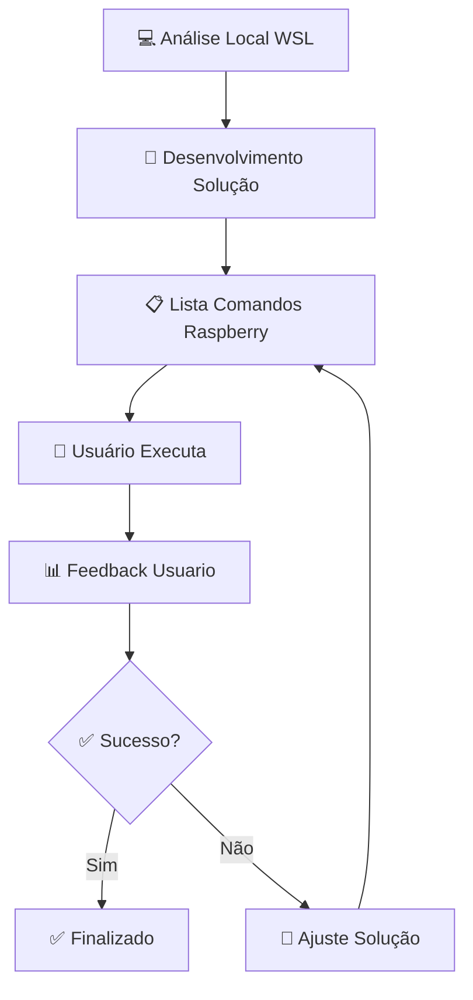

# 🤖 **WORKFLOW COMANDOS RASPBERRY PI - F1TENTH**

## 🎯 **METODOLOGIA DE TRABALHO**

### **🔄 Fluxo de Desenvolvimento Definido**



---

## 📋 **TEMPLATE PADRÃO DE COMANDOS**

### **🎯 Estrutura Obrigatória**
```markdown
## 📋 **COMANDOS PARA EXECUTAR NO RASPBERRY PI**

### **Passo X: [Título Descritivo]**
```bash
comando_exato_aqui
```
**Objetivo**: O que este comando faz
**Localização**: Onde executar (diretório)
**Esperado**: Output esperado ou resultado

---

## ⏳ **AGUARDANDO FEEDBACK**
Execute os comandos acima e reporte:
- ✅ Comandos executados com sucesso
- ❌ Erros encontrados (copie output completo)
- 📊 Outputs importantes ou diferentes do esperado
- 🔄 Status atual do sistema
```

---

## 🚀 **COMANDOS ESSENCIAIS POR CATEGORIA**

### **📦 WORKSPACE & BUILD**
```bash
# Navegar para workspace
cd ~/f1tenth_ws

# Verificar estrutura
ls -la src/

# Build completo
colcon build --symlink-install

# Build com limpeza
rm -rf build/ install/ log/
colcon build --symlink-install

# Source workspace
source install/setup.bash

# Build pacote específico
colcon build --packages-select f1tenth_control --symlink-install
```

### **🏃 EXECUÇÃO & LAUNCH**
```bash
# Launch sistema completo
ros2 launch f1tenth_control f1tenth_full.launch.py

# Launch controle básico
ros2 launch f1tenth_control f1tenth_control.launch.py

# Launch enhanced control
ros2 launch f1tenth_control enhanced_f1tenth.launch.py

# Executar nó individual
ros2 run f1tenth_control servo_control_node

# Executar com parâmetros
ros2 run f1tenth_control servo_control_node --ros-args -p control_frequency:=100.0
```

### **🔍 DIAGNÓSTICO & DEBUG**
```bash
# Listar nós ativos
ros2 node list

# Info detalhada do nó
ros2 node info /servo_control_node

# Listar tópicos
ros2 topic list

# Monitorar tópico
ros2 topic echo /drive

# Frequência do tópico
ros2 topic hz /scan

# Bandwidth do tópico
ros2 topic bw /drive

# Parâmetros do nó
ros2 param list /servo_control_node
ros2 param get /servo_control_node control_frequency

# Verificar transforms
ros2 run tf2_tools view_frames
```

### **🔧 HARDWARE & SISTEMA**
```bash
# Verificar dispositivos USB
lsusb

# Verificar portas seriais
ls -la /dev/tty*

# Verificar GPIO
gpio readall

# Status pigpio daemon
sudo systemctl status pigpiod

# Iniciar pigpio daemon
sudo systemctl start pigpiod
sudo systemctl enable pigpiod

# Verificar logs do sistema
journalctl -f
sudo dmesg | tail -20

# Monitor recursos
top
htop
free -h
```

### **🛠️ TROUBLESHOOTING**
```bash
# Problema: Permission Denied GPIO
sudo usermod -a -G gpio $USER
newgrp gpio

# Problema: Serial Port Access
sudo usermod -a -G dialout $USER
newgrp dialout

# Problema: Dependencies
rosdep install --from-paths src --ignore-src -r -y

# Problema: Build Errors
colcon build --symlink-install --verbose

# Problema: Node não responde
ps aux | grep servo_control
killall servo_control_node

# Limpeza completa
rm -rf build/ install/ log/
sudo apt autoremove
sudo apt autoclean
```

---

## 📊 **VALIDAÇÃO & TESTES**

### **✅ Checklist Pré-Execução**
```bash
# 1. Verificar localização
pwd
# Deve estar em: /home/[user]/f1tenth_ws

# 2. Verificar workspace sourced
echo $ROS_DOMAIN_ID
env | grep ROS

# 3. Verificar hardware conectado
ls /dev/ttyACM*
ls /dev/ttyUSB*

# 4. Verificar daemon pigpio
sudo systemctl is-active pigpiod

# 5. Verificar permissões
groups $USER
```

### **🎯 Testes de Funcionalidade**
```bash
# Teste 1: ROS2 funcionando
ros2 topic list

# Teste 2: Hardware GPIO
gpio read 12

# Teste 3: Comunicação VESC
ros2 topic echo /vesc/core --once

# Teste 4: Servo response
ros2 topic pub /drive ackermann_msgs/msg/AckermannDriveStamped "{drive: {steering_angle: 0.1, speed: 0.0}}" --once

# Teste 5: Sistema completo
ros2 launch f1tenth_control f1tenth_control.launch.py &
sleep 5
ros2 topic hz /drive
```

---

## 🔄 **CENÁRIOS COMUNS DE USO**

### **Cenário 1: Primeira Execução**
```bash
# Passo 1: Setup inicial
cd ~/f1tenth_ws
source /opt/ros/humble/setup.bash

# Passo 2: Build inicial
colcon build --symlink-install

# Passo 3: Source workspace
source install/setup.bash

# Passo 4: Teste básico
ros2 run f1tenth_control servo_control_node
```

### **Cenário 2: Após Mudanças no Código**
```bash
# Passo 1: Parar processos
Ctrl+C (nos terminais ativos)

# Passo 2: Rebuild
cd ~/f1tenth_ws
colcon build --packages-select f1tenth_control --symlink-install

# Passo 3: Source atualizado
source install/setup.bash

# Passo 4: Teste novo código
ros2 launch f1tenth_control f1tenth_control.launch.py
```

### **Cenário 3: Debug de Problemas**
```bash
# Passo 1: Verificar status
ros2 node list
ros2 topic list

# Passo 2: Logs detalhados
ros2 launch f1tenth_control f1tenth_control.launch.py --ros-args --log-level DEBUG

# Passo 3: Monitor recursos
top -p $(pgrep -d',' ros)

# Passo 4: Verificar hardware
sudo dmesg | grep -i error
journalctl -u pigpiod -f
```

---

## 📝 **FORMATO DE FEEDBACK ESPERADO**

### **✅ Feedback de Sucesso**
```
Comando executado: ros2 launch f1tenth_control f1tenth_control.launch.py
Status: ✅ SUCESSO
Output: 
[INFO] [launch]: All nodes launched successfully
[INFO] [servo_control_node]: Servo control initialized
[INFO] [servo_control_node]: GPIO pin 12 configured for PWM

Sistema: Funcionando corretamente, servo respondendo aos comandos
```

### **❌ Feedback de Erro**
```
Comando executado: ros2 run f1tenth_control servo_control_node
Status: ❌ ERRO
Erro completo:
Traceback (most recent call last):
  File "/home/user/f1tenth_ws/install/f1tenth_control/lib/f1tenth_control/servo_control_node", line 33, in <module>
    sys.exit(load_entry_point('f1tenth-control==0.0.0', 'console_scripts', 'servo_control_node')())
ModuleNotFoundError: No module named 'pigpio'

Sistema: Node não consegue iniciar devido dependência faltante
```

### **📊 Feedback Informativo**
```
Comando executado: ros2 topic hz /drive
Status: 📊 INFORMAÇÃO
Output:
average rate: 50.125
  min: 0.019s max: 0.021s std dev: 0.00034s window: 52

Observação: Frequência está dentro do esperado (50Hz target)
```

---

## 📚 **REFERÊNCIAS RÁPIDAS**

### **🔗 Links Úteis**
- **ROS2 CLI**: `ros2 --help`
- **Launch Files**: `~/f1tenth_ws/src/f1tenth_control/launch/`
- **Config Files**: `~/f1tenth_ws/src/f1tenth_control/config/`
- **Logs**: `~/.ros/log/` ou `ros2 launch ... --ros-args --log-level DEBUG`

### **📞 Comandos de Emergência**
```bash
# Parar tudo
killall ros2
sudo systemctl stop pigpiod

# Reiniciar sistema
sudo reboot

# Reset GPIO
gpio reset
```

---

> 🎯 **REGRA PRINCIPAL**: Sempre aguardar feedback antes do próximo passo
> 📋 **FORMATO**: Usar template padrão para todos os comandos  
> 🔄 **ITERAÇÃO**: Ajustar baseado nos resultados reportados
> ⏳ **PACIÊNCIA**: Não prosseguir sem confirmação do usuário 